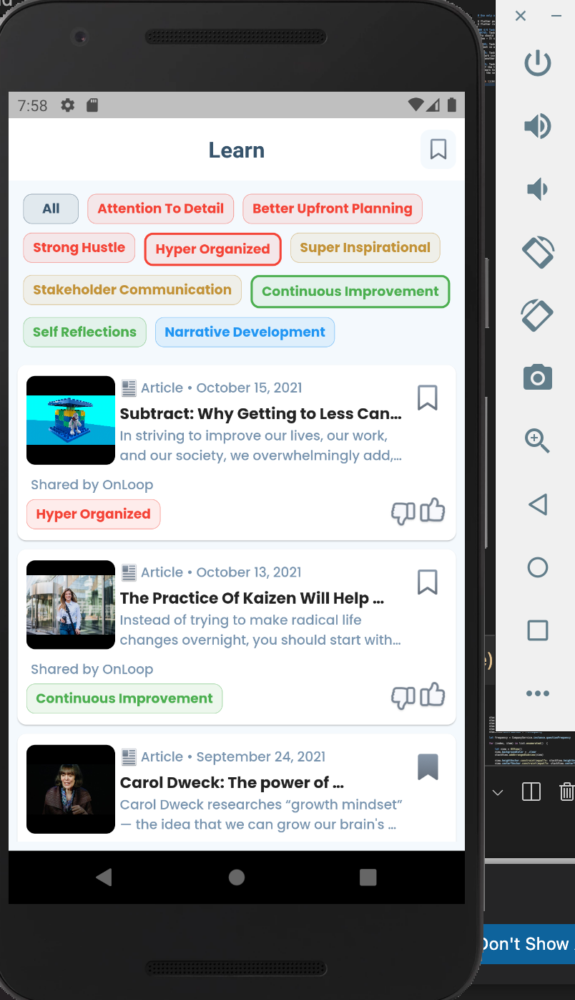
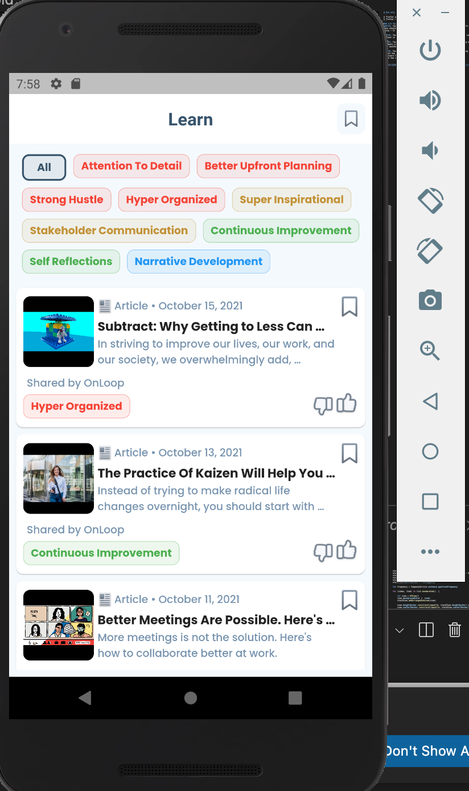
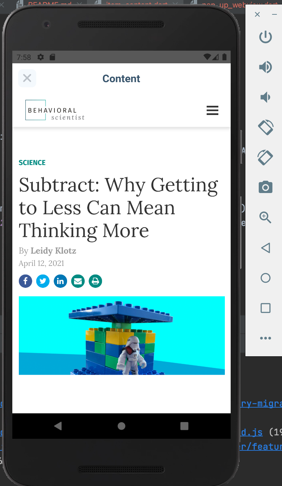
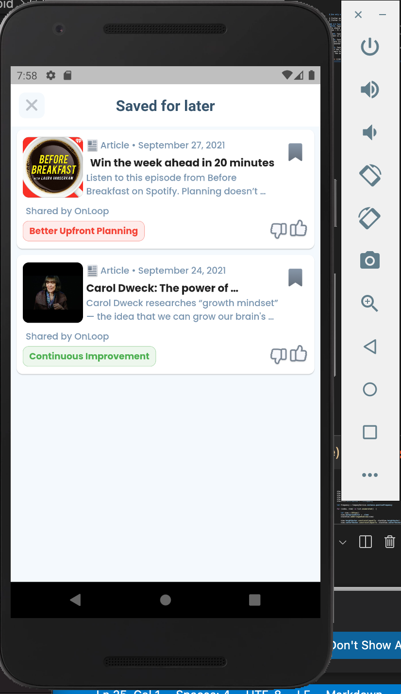

### Run the project in android device or emulator only
```
$ flutter pub get
$ flutter run
```
### 4/4 Task Accomplished
&#9745; Task 1 - Render the Learn Feed to match the screenshot on the left. -
Data should load from the APIs specified in the APIs section
below - It should be a scrollable page.

&#9745; Task 2 - Tapping on the body of the content card should open the Learn
Content in an in-app browser

&#9745; Task 3 - Save the learn content under the 'Save' list by clicking on the
Bookmark icon. - Clicking on the 'Save' icon the Appbar should
open another page with list of saved learn content

&#9745; Task 4 - Filter learn content based on the tags selected - Tapping on
any of the tags in the Tags List near the top of the UI should filter
the Learn Content list to only show Learn content with tags that
match the selected one.

#Demo Video

<p>




</p>

